# NGRSSOLVER - Complete Workflow Flowchart

## Overall System Workflow

```mermaid
flowchart TD
    Start([User Request]) --> Interface{Entry Point?}

    Interface -->|REST API| API[FastAPI Server<br/>api_server.py]
    Interface -->|Command Line| CLI[CLI Tool<br/>run_solver.py]
    Interface -->|Async Job| REDIS[Redis Job Queue<br/>redis_worker.py]

    API --> Solver[Unified Solver Core<br/>solver.py]
    CLI --> Solver
    REDIS --> Solver

    Solver --> Validate[Phase 1: Input Validation<br/>input_validator.py]

    Validate --> ValidCheck{Valid Input?}
    ValidCheck -->|No| Error1[Return Error:<br/>Schema Violation]
    ValidCheck -->|Yes| Preprocess

    Preprocess[Phase 2: Preprocessing Decision] --> HasPattern{Employees Have<br/>Work Patterns?}

    HasPattern -->|Yes| OffsetStagger[Offset Staggering<br/>offset_manager.py<br/>Adjust rotation offsets]
    HasPattern -->|No| ICPMP[ICPMP v3.0 Preprocessing<br/>icpmp_integration.py]

    ICPMP --> ICPMP1[Calculate Optimal<br/>Employee Count]
    ICPMP1 --> ICPMP2[Filter by Scheme &<br/>Qualifications]
    ICPMP2 --> ICPMP3[Select Balanced Subset<br/>14-20 from 100+]
    ICPMP3 --> ICPMP4[Assign Rotation<br/>Offsets 0-5]
    ICPMP4 --> DataLoad

    OffsetStagger --> DataLoad[Phase 3: Data Loading<br/>data_loader.py]

    DataLoad --> DataLoad1[Load & Normalize<br/>Input JSON]
    DataLoad1 --> DataLoad2[Build OU Mappings]
    DataLoad2 --> DataLoad3[Extract Rostering Basis]
    DataLoad3 --> SlotGen

    SlotGen[Phase 4: Slot Generation<br/>slot_builder.py] --> SlotGen1[Convert Demand Items<br/>to Shift Slots]
    SlotGen1 --> SlotGen2[Apply Rotation Patterns<br/>D-D-N-N-O-O-O]
    SlotGen2 --> SlotGen3[Generate Daily Slots<br/>for Planning Horizon]
    SlotGen3 --> SlotGen4[Apply Shift Times &<br/>Qualifications]
    SlotGen4 --> SlotOutput[Output: 1000s of<br/>Slot Objects]

    SlotOutput --> ModelBuild[Phase 5: CP-SAT Model Building<br/>solver_engine.py]

    ModelBuild --> CreateVars[Create Decision Variables<br/>x for slot,emp in 0,1]
    CreateVars --> FilterPairs[Filter Employee-Slot Pairs]

    FilterPairs --> Filter1[Product Type Match]
    Filter1 --> Filter2[Rank Match OR Logic]
    Filter2 --> Filter3[Gender Requirements]
    Filter3 --> Filter4[Scheme Matching]
    Filter4 --> Filter5[Blacklist Dates]
    Filter5 --> UnassignedVars[Create Unassigned<br/>Slot Variables]

    UnassignedVars --> ConstraintApp[Phase 6: Constraint Application<br/>solver_engine.py]

    ConstraintApp --> HardConst[Apply Hard Constraints<br/>C1-C19]

    HardConst --> C1[C1: Daily Hours Cap<br/>14h/13h/9h by scheme]
    C1 --> C2[C2: Weekly Normal Hours<br/>44-52h limits]
    C2 --> C3[C3: Consecutive Days<br/>Maximum work days]
    C3 --> C4[C4: Rest Period<br/>Min hours between shifts]
    C4 --> C5to19[C5-C19: Off-days, Licensing<br/>Gender, Teams, OT Caps...]

    C5to19 --> SoftConst[Apply Soft Constraints<br/>S1-S17]

    SoftConst --> S1[S1: Pattern Adherence<br/>Minimize deviations]
    S1 --> S2[S2: Shift Preferences<br/>Employee preferences]
    S2 --> S3[S3: Consistent Start Times<br/>Shift continuity]
    S3 --> S4to17[S4-S17: Team Cohesion<br/>Travel, Fairness...]

    S4to17 --> Objective[Build Objective Function<br/>Minimize Penalty Score]

    Objective --> CPSATSolve[Phase 7: OR-Tools CP-SAT Solving<br/>Google OR-Tools Engine]

    CPSATSolve --> ConfigSolver[Configure Solver Parameters]
    ConfigSolver --> TimeLimit[Time Limit: 5-60s<br/>Adaptive]
    TimeLimit --> Workers[Parallel Workers: 1-16<br/>Based on complexity]
    Workers --> Execute[Execute Constraint<br/>Programming]

    Execute --> SolveStatus{Solution<br/>Status?}

    SolveStatus -->|OPTIMAL| Extract[Phase 8: Solution Extraction]
    SolveStatus -->|FEASIBLE| Extract
    SolveStatus -->|INFEASIBLE| Infeasible[Mark as Infeasible<br/>Record unmet demand]

    Infeasible --> Extract

    Extract --> ExtractAssign[Extract Assignments<br/>from Solution]
    ExtractAssign --> CalcViolations[Calculate Hard/Soft<br/>Violations]
    CalcViolations --> ComputeScores[Compute Scores]

    ComputeScores --> OutputBuild[Phase 9: Output Building<br/>output_builder.py]

    OutputBuild --> FormatJSON[Format Results to<br/>JSON Schema v0.95+]
    FormatJSON --> CalcHours[Calculate Employee Hours<br/>Normal, OT, Monthly]
    CalcHours --> BuildRoster[Build Employee Roster<br/>Daily status per employee]
    BuildRoster --> GenMeta[Generate Metadata<br/>Timing, hash, warnings]
    GenMeta --> ScoreBreakdown[Create Score Breakdown<br/>Violation analysis]

    ScoreBreakdown --> OutputJSON[Output JSON File]

    OutputJSON --> OutputStructure{Output Contains:}

    OutputStructure --> Assignments[assignments: Work shifts]
    OutputStructure --> EmployeeRoster[employeeRoster: Daily schedules]
    OutputStructure --> UnmetDemand[unmetDemand: Unfilled slots]
    OutputStructure --> ScoreDetails[scoreBreakdown: Violations]
    OutputStructure --> SolverMeta[solverRun: Execution metadata]

    Assignments --> End([Return to User])
    EmployeeRoster --> End
    UnmetDemand --> End
    ScoreDetails --> End
    SolverMeta --> End
    Error1 --> End

    style Start fill:#e1f5e1
    style End fill:#ffe1e1
    style Solver fill:#e1e5ff
    style ICPMP fill:#fff4e1
    style CPSATSolve fill:#ffe1f5
    style OutputJSON fill:#e1f5e1
    style Error1 fill:#ffcccc
```

## Detailed Phase Breakdown

### Phase 1: Input Validation
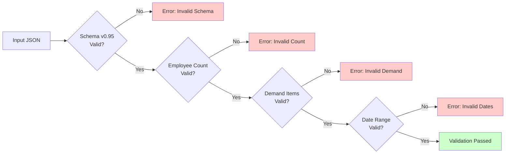

### Phase 2: ICPMP Preprocessing Flow
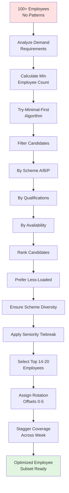

### Phase 3: Slot Generation Process
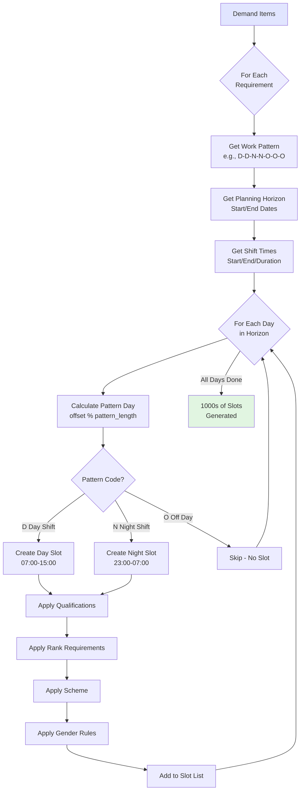

### Phase 4: CP-SAT Model Building
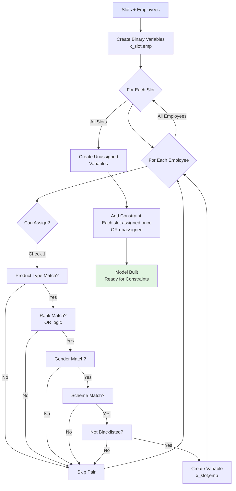

### Phase 5: Constraint Evaluation
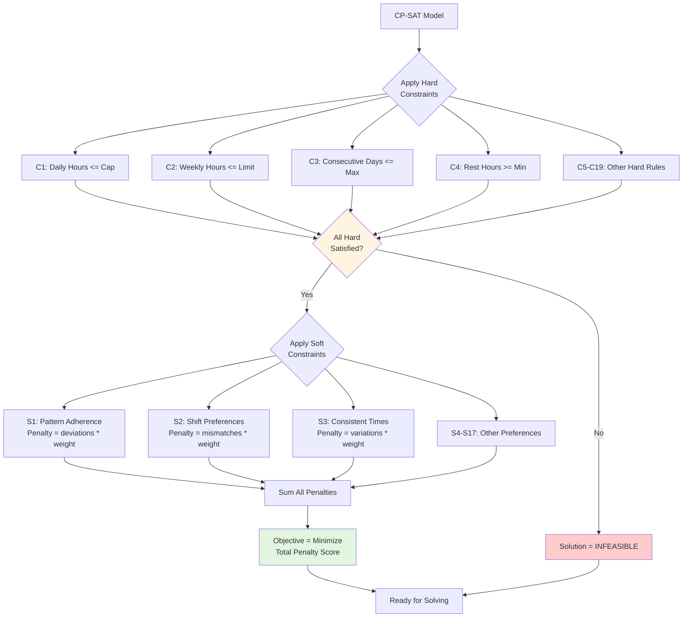

### Phase 6: OR-Tools Solving Process
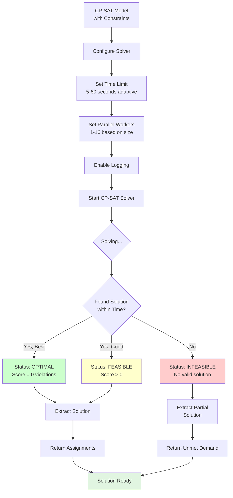

### Phase 7: Output Building
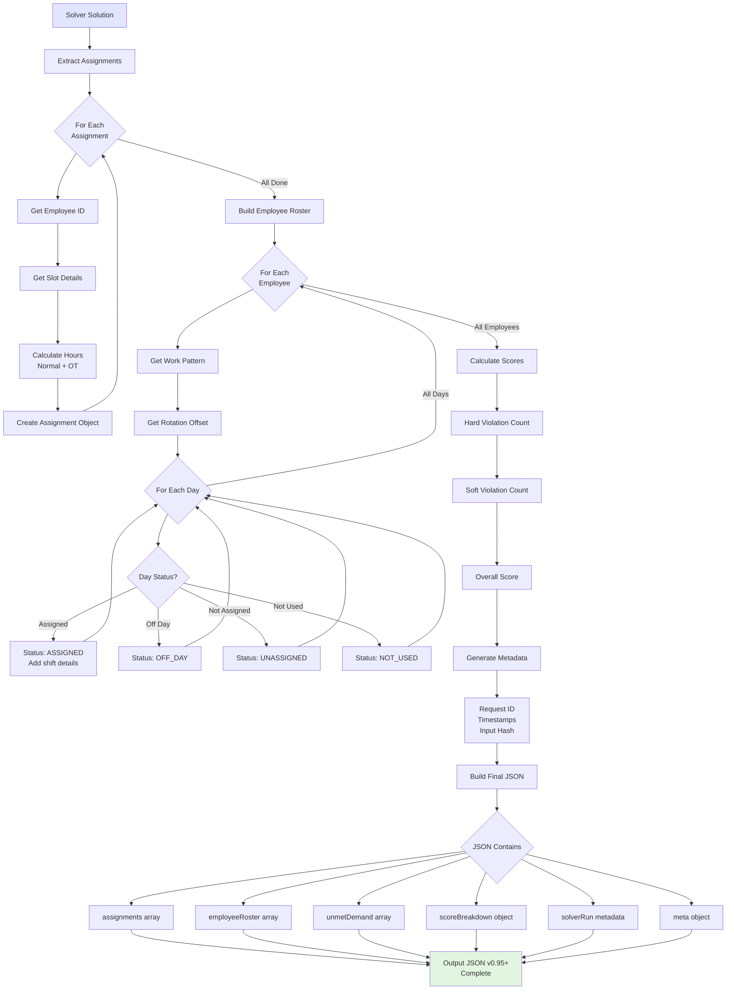

## Rostering Mode Decision Tree

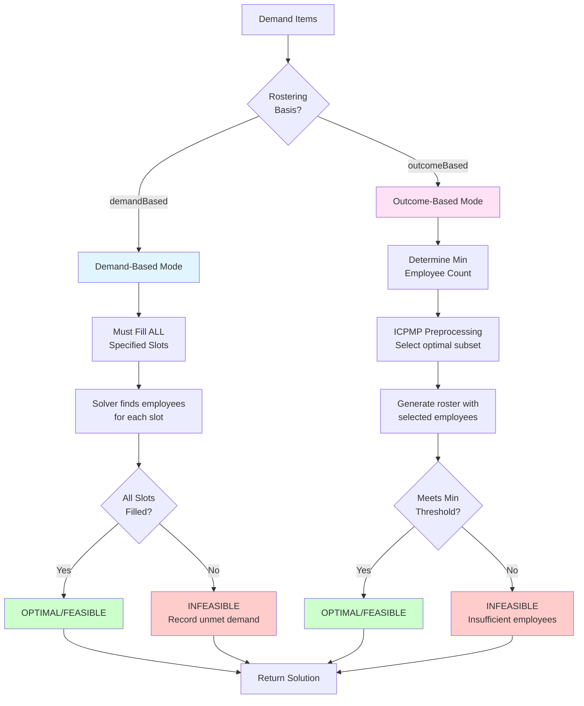

## Time Calculation Flow

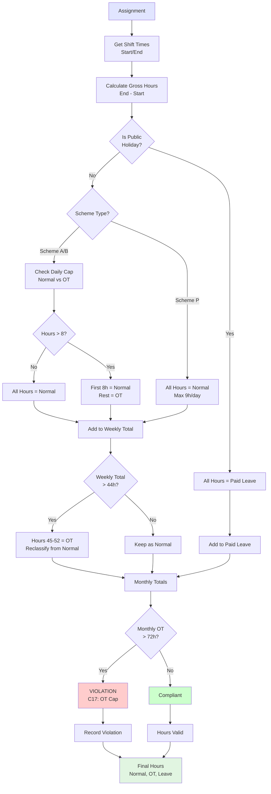

## System Integration Overview

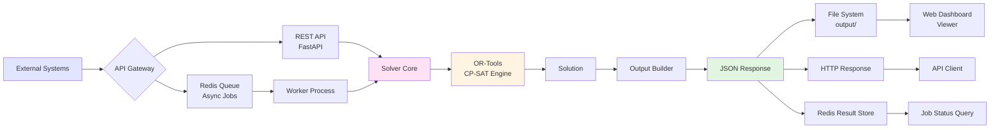

---

## How to View This Flowchart

### In VS Code:
1. Install "Markdown Preview Mermaid Support" extension
2. Open this file and press `Cmd+Shift+V` (Mac) or `Ctrl+Shift+V` (Windows)
3. Flowcharts will render interactively

### In GitHub:
- GitHub automatically renders Mermaid diagrams in markdown files

### Online:
- Copy the mermaid code blocks to https://mermaid.live for interactive editing

---

**NGRSSOLVER v0.96.0**
**Documentation Generated**: 2026-01-13
