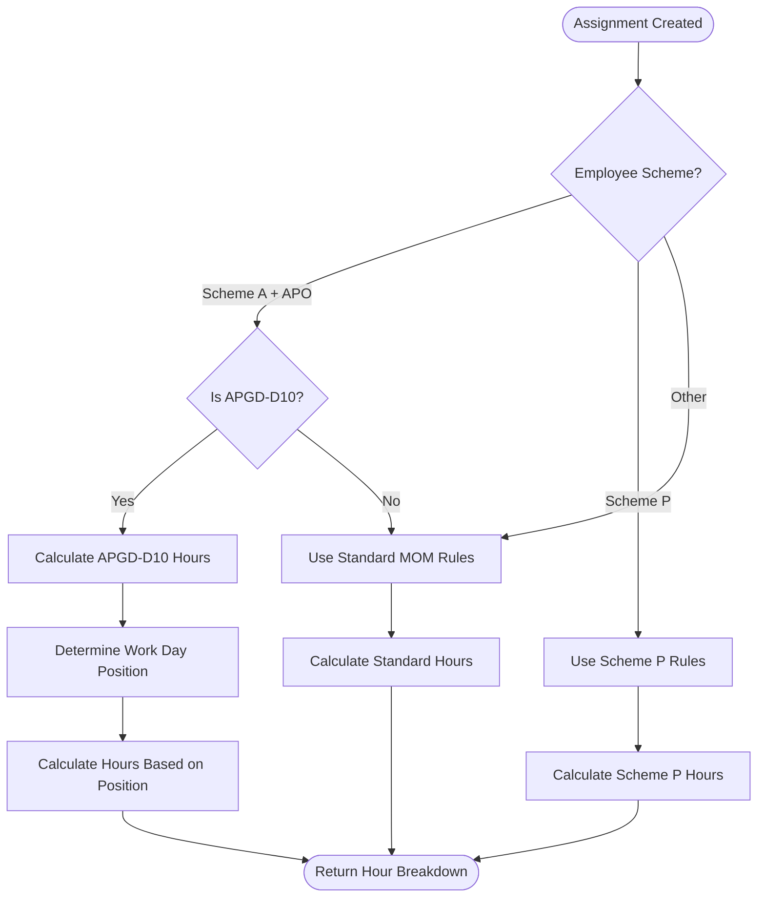
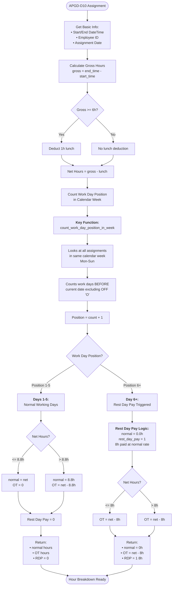
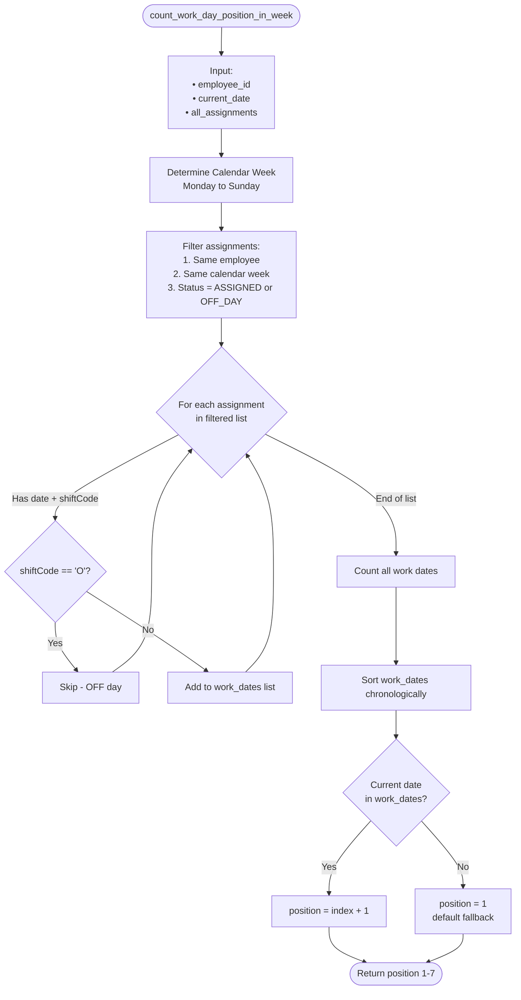
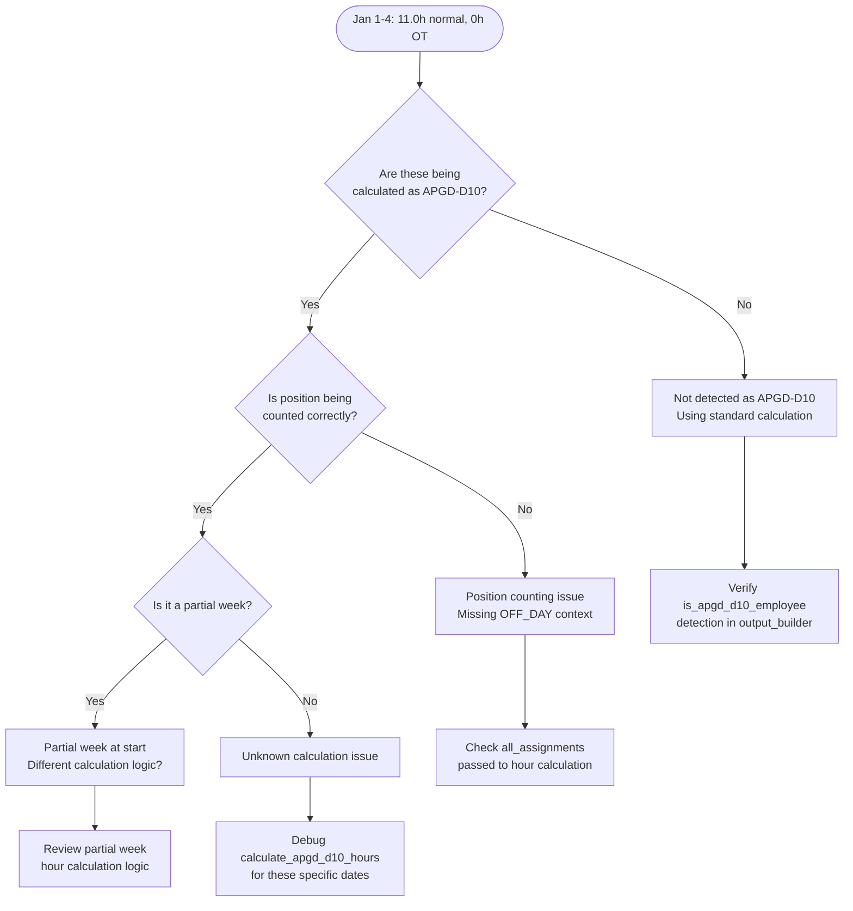
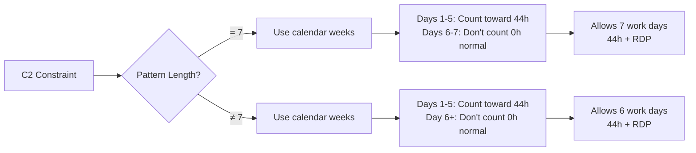
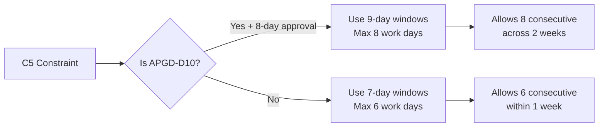

# Hour Calculation & Rest Day Pay Workflow

## Overview
This document explains how normal hours, overtime hours, and rest day pay are calculated, especially for APGD-D10 employees (Scheme A + APO + COR/SGT ranks).

---

## 1. Overall Workflow



---

## 2. APGD-D10 Hour Calculation (Detailed)



---

## 3. Work Day Position Counting Logic



---

## 4. Example Scenarios

### Scenario A: Standard 5-Day Week (Mon-Fri work, Sat-Sun OFF)

```
Week of Jan 5-11, 2026:

Mon Jan 5:  Position 1 → 8.8h normal + 2.2h OT + 0 RDP
Tue Jan 6:  Position 2 → 8.8h normal + 2.2h OT + 0 RDP
Wed Jan 7:  Position 3 → 8.8h normal + 2.2h OT + 0 RDP
Thu Jan 8:  Position 4 → 8.8h normal + 2.2h OT + 0 RDP
Fri Jan 9:  Position 5 → 8.8h normal + 2.2h OT + 0 RDP
Sat Jan 10: OFF_DAY (not counted)
Sun Jan 11: OFF_DAY (not counted)

Weekly Total: 44.0h normal + 11.0h OT
✅ MOM Compliant: 44h ≤ 44h cap
```

### Scenario B: 6-Day Week (Mon-Sat work, Sun OFF)

```
Week of Jan 5-11, 2026:

Mon Jan 5:  Position 1 → 8.8h normal + 2.2h OT + 0 RDP
Tue Jan 6:  Position 2 → 8.8h normal + 2.2h OT + 0 RDP
Wed Jan 7:  Position 3 → 8.8h normal + 2.2h OT + 0 RDP
Thu Jan 8:  Position 4 → 8.8h normal + 2.2h OT + 0 RDP
Fri Jan 9:  Position 5 → 8.8h normal + 2.2h OT + 0 RDP
Sat Jan 10: Position 6 → 0.0h normal + 3.0h OT + 1 RDP (8h)
Sun Jan 11: OFF_DAY (not counted)

Weekly Total: 44.0h normal + 14.0h OT + 8h RDP
✅ MOM Compliant: 44h ≤ 44h cap
✅ Day 6 gets Rest Day Pay instead of normal hours
```

### Scenario C: 7-Day Week (All days work, APGD-D10)

```
Week of Jan 5-11, 2026:

Mon Jan 5:  Position 1 → 8.8h normal + 2.2h OT + 0 RDP
Tue Jan 6:  Position 2 → 8.8h normal + 2.2h OT + 0 RDP
Wed Jan 7:  Position 3 → 8.8h normal + 2.2h OT + 0 RDP
Thu Jan 8:  Position 4 → 8.8h normal + 2.2h OT + 0 RDP
Fri Jan 9:  Position 5 → 8.8h normal + 2.2h OT + 0 RDP
Sat Jan 10: Position 6 → 0.0h normal + 3.0h OT + 1 RDP (8h)
Sun Jan 11: Position 7 → 0.0h normal + 3.0h OT + 1 RDP (8h)

Weekly Total: 44.0h normal + 17.0h OT + 16h RDP (2 days)
✅ MOM Compliant: 44h ≤ 44h cap
✅ Days 6-7 get Rest Day Pay
```

### Scenario D: 8 Consecutive Days (APGD-D10 Special Approval)

```
Week 1 (Jan 5-11, 2026):
Mon Jan 5:  Position 1 → 8.8h normal + 2.2h OT + 0 RDP
Tue Jan 6:  Position 2 → 8.8h normal + 2.2h OT + 0 RDP
Wed Jan 7:  Position 3 → 8.8h normal + 2.2h OT + 0 RDP
Thu Jan 8:  Position 4 → 8.8h normal + 2.2h OT + 0 RDP
Fri Jan 9:  Position 5 → 8.8h normal + 2.2h OT + 0 RDP
Sat Jan 10: Position 6 → 0.0h normal + 3.0h OT + 1 RDP (8h)
Sun Jan 11: Position 7 → 0.0h normal + 3.0h OT + 1 RDP (8h)

Week 1 Total: 44.0h normal + 17.0h OT + 16h RDP

Week 2 (Jan 12-18, 2026):
Mon Jan 12: Position 1 → 8.8h normal + 2.2h OT + 0 RDP  ← Day 8 consecutive!
Tue Jan 13: OFF_DAY (mandatory rest after 8 days)

This is the 8th consecutive day spanning two calendar weeks.
Weekly OFF requirement relaxed for APGD-D10.
```

---

## 5. Issue Found: Jan 1-4 Showing Incorrect Hours

### Problem
```
Jan 1-4 (Thu-Sun) showing:
  Each day: 11.0h normal + 0h OT

Expected for APGD-D10:
  Each day: 8.8h normal + 2.2h OT (for 12h gross shifts)
  OR if day 6+: 0h normal + 3h OT + 1 RDP
```

### Possible Causes



### Investigation Steps

1. **Check APGD-D10 Detection**:
   ```python
   # In output_builder.py
   is_apgd = is_apgd_d10_employee(employee, requirement)
   # Should be True for Scheme A + APO employees
   ```

2. **Check Assignment Context**:
   ```python
   # Hour calculation should receive all assignments
   hours_dict = calculate_apgd_d10_hours(
       start_dt=start_dt,
       end_dt=end_dt,
       employee_id=emp_id,
       assignment_date_obj=date_obj,
       all_assignments=assignments,  # ← Must include ALL assignments!
       employee_dict=employee
   )
   ```

3. **Check Partial Week Handling**:
   ```python
   # Jan 1-4 is a partial week (Thu-Sun, only 4 days)
   # Week starts Jan 1 (Thu), not a full Mon-Sun week
   # Position counting might be affected
   ```

4. **Verify Gross/Net Calculation**:
   ```python
   # For 12h shift (08:00-20:00):
   # gross = 12.0h
   # lunch = 1.0h (if gross >= 6h)
   # net = 11.0h
   # 
   # For APGD-D10 day 1-5:
   # normal = 8.8h (fixed cap)
   # OT = 11.0 - 8.8 = 2.2h
   ```

---

## 6. Constraint Logic Impact on Hours

### C2: Weekly Normal Hours Cap



### C5: Minimum OFF Days Per Week



---

## 7. Key Functions Reference

| Function | Location | Purpose |
|----------|----------|---------|
| `calculate_apgd_d10_hours()` | `context/engine/time_utils.py` | Main APGD-D10 hour calculator |
| `count_work_day_position_in_week()` | `context/engine/time_utils.py` | Determines position (1-7) in calendar week |
| `is_apgd_d10_employee()` | `context/engine/time_utils.py` | Detects Scheme A + APO employees |
| `_group_dates_by_week()` | `context/engine/cpsat_template_generator.py` | Groups dates into Mon-Sun weeks |

---

## 8. Next Steps for Debugging Jan 1-4 Issue

1. **Add debug logging** to trace hour calculation for these dates
2. **Check if partial week** (4 days) triggers different logic
3. **Verify all_assignments** includes OFF_DAY entries for position counting
4. **Confirm APGD-D10 detection** is working in output builder
5. **Test with full week** starting Monday to compare behavior

---

## Appendix: APGD-D10 Rules Summary

| Aspect | Standard | APGD-D10 |
|--------|----------|----------|
| Max Consecutive Days | 12 | 8 |
| Weekly Normal Cap | 44h | 44h |
| Monthly OT Cap | 72h | 144h (foreign COR/SGT)<br/>246h total inc. normal |
| Days 1-5 Hours | 8.8h normal + OT | 8.8h normal + OT |
| Day 6+ Hours | Not typical | 0h normal + 8h RDP + OT |
| Weekly OFF | Required in 7 days | Flexible for 8 days |
| Schemes | All | Scheme A only |
| Products | All | APO only |
| Ranks | All | COR, SGT (foreign) |
